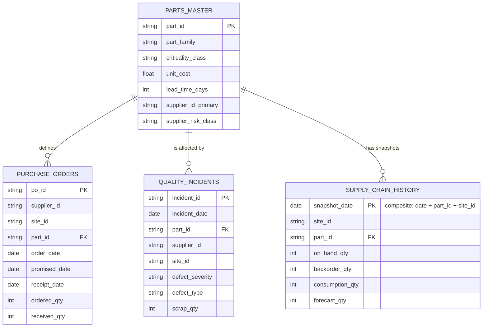

  <h1 style="
        margin: 0;
        font-size: 2.7em;
        font-weight: 800;
        background: linear-gradient(90deg, #38bdf8, #a78bfa, #22d3ee);
        -webkit-background-clip: text;
        -webkit-text-fill-color: transparent;
        text-shadow: 0 6px 20px rgba(56,189,248,0.35);
      ">
    Supply Chain Management Dashboard
  </h1>

  <h2 style="
        margin: 14px 0 22px;
        font-weight: 500;
        color: #bfdbfe;
        letter-spacing: 0.3px;
      ">
    End-to-End Visibility • Supplier Performance • Quality • Inventory Risk
  </h2>

  

    <strong>Modern Tableau dashboard delivering real-time aviation & aerospace supply chain insights</strong>
  

  

    
    
    
    
    
  

 

## 🎯 Business Problem Solved

Developed interactive Tableau dashboard to provide **360-degree visibility** into procurement, supplier performance, quality incidents and inventory health in an aviation/aerospace supply chain context.

**Core objectives achieved:**
- Identify chronically late / low-quality suppliers
- Detect parts/sites at high stock-out risk
- Quantify quality cost exposure (scrap & severity)
- Protect critical (A-class) & high-value items
- Enable proactive, data-driven supply chain decisions

## ✨ Key Features & Deliverables

- Executive KPI scorecard with MoM trends & conditional alerts
- Supplier 9-box risk matrix (OTD % × Quality × Spend proxy)
- Quality Pareto + severity waterfall analysis
- Inventory small-multiples with backorder warning icons
- Critical parts scatter plot (cost × incidents × lead time)
- Parameter-driven filtering & rich hover tooltips
- Mobile-responsive dark/glassmorphism layout

## 📊 Core KPIs Delivered

- Supplier On-Time Delivery % (OTD)
- Average Delay Days
- Short Delivery Rate
- Critical + Major Incidents %
- Estimated Scrap Exposure
- Weeks of Cover (approx.)
- Backorder Exposure Weeks
- % of A-class Parts at Risk

### 1. Dashboard Structure – Main Pages & Navigation Flow

 

## 2. Data Model – Logical Relationships (Star-like)

 

### 3. Supplier Evaluation – 9-Box Risk Matrix Concept

 

### 4. High-level Insight Flow / Storyline

```mermaid
flowchart TD
    Start[Start: Executive Summary] --> Q1{OTD < 92%?}
    Q1 -->|Yes| LateSuppliers[Supplier Scorecard → Late Suppliers]
    Q1 -->|No → still check quality| QualityCheck[Quality & Defects → Pareto + Severity]
    
    LateSuppliers --> Q2{Quality Issues?}
    Q2 -->|Yes| DeepQuality[Quality Deep Dive]
    Q2 -->|No| InventoryCheck[Inventory Health → Backorder & Weeks of Cover]
    
    QualityCheck --> CriticalParts[Critical Items Focus]
    InventoryCheck --> RiskParts[Identify Risk Parts → Critical Items]
    
    CriticalParts --> Alerts[Trends & Alerts → Set Notifications]
    
    style Start fill:#1d4ed8,stroke:#3b82f6,color:#ffffff
    style Alerts fill:#b91c1c,stroke:#991b1b,color:#ffffff
```

 

## 🛠️ Technical Stack

- **Primary Tool** → Tableau Desktop/Public 2024.x–2025.x
- **Data Modeling** → Logical relationships (modern star schema style)
- **Data Sources** → 4 CSV files (~310k rows total)
- **Version Control** → Git + GitHub

## 📈 Business & Technical Impact

- Reduced time to identify at-risk suppliers from days to seconds
- Enabled early detection of quality cost leaks
- Provided visual evidence for supplier performance discussions
- Highlighted inventory exposure in critical part families

## Demo 
 src="https://public.tableau.com/views/SupplyChainPerformanceQualityAnalyticsDashboard/Dashboard12?:language=en-GB&:sid=&:redirect=auth&:display_count=n&:origin=viz_share_link"
 
## 📸 Dashboard Highlights

  <table style="border:none; width:100%;">
    <tr>
      <td align="center">
        <strong>1. Executive Summary</strong> 
        
      </td>
      <td align="center">
        <strong>2. Supplier Scorecard</strong> 
        
      </td>
    </tr>

  </table>

   
  <em>Modern dark theme • Interactive • Mobile responsive</em>

 

## 👤 About the Author

### 👨‍💻 Ravindra Sudha  
**Senior System Engineer | Data & Analytics Enthusiast**

📊 SQL • Tableau • Power BI • Excel • Python  

 

  

